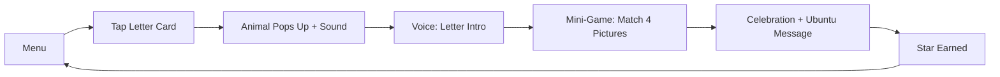

# NovaLearning Letter Recognition Game - Master Context

> **AUTO-TRIGGER ENABLED** - This file is automatically loaded at session start.
> Claude Code will read this context before any operation.

## 🎯 Project Mission

Build phygital educational product: 50-page printed workbook + QR-linked web games for SA Grade R (ages 5-6).
**MVP Focus:** Letters A-F with 6 Ubuntu Buddy characters (SA animals teaching with Ubuntu philosophy).

## 📋 Current Sprint: Letter Recognition MVP

| Field | Value |
|-------|-------|
| **Timeline** | 3-4 weeks |
| **Status** | Planning → Implementation |
| **Target Device** | Galaxy A03 (2GB RAM, Mali-G52) |
| **Deployment** | Offline-first PWA |
| **Owner** | Damian Harrison |

## 🛠️ Tech Stack (DECIDED - NO CHANGES)

| Layer | Technology | Notes |
|-------|------------|-------|
| Game Engine | Phaser 3.88 | 2D/2.5D hybrid |
| 3D Assets | Blender MCP | → rendered sprite sheets (512x512, 8 frames) |
| Audio | Howler.js | English phonics, animal sounds, feedback |
| State | Zustand + localStorage | Persistent progress |
| Offline | Service Worker | 50MB cache budget |
| Build | Vite → Vercel | Edge deployment |

## 🦁 Ubuntu Buddies Characters (6)

| Letter | Animal | Character | Hex Color | Ubuntu Value | Fun Fact |
|--------|--------|-----------|-----------|--------------|----------|
| A | Aardvark | Ayo | #E85D04 | Achievement | "Aardvarks can eat 50,000 termites in one night!" |
| B | Baboon | Buhle | #4CC9F0 | Bravery | "Baboons live on Table Mountain in Cape Town!" |
| C | Cheetah | Cindy | #F4A261 | Champions | "Cheetahs are the fastest land animals!" |
| D | Dung Beetle | Dumisani | #8D6748 | Determination | "Dung beetles can roll balls 10x their weight!" |
| E | Elephant | Elethu | #52B788 | Empathy (Ubuntu) | "Elephants remember their friends forever!" |
| F | Flamingo | Fezile | #FF6B9D | Family | "Flamingos turn pink from eating shrimp!" |

## 📦 Asset Inventory (Available Now)

### GitHub Repos (Key Forks)
- `phaser` - Game engine source
- `phaser-by-example` - Pattern reference
- `howler.js` - Audio library
- `zustand` - State management

### MCP Tools (25+ Available)
- **Asset Generation:** Blender MCP, Canva MCP, HuggingFace
- **Development:** GitHub, Vercel, Sentry, Supabase
- **Automation:** Zapier, N8N (self-hosted)

### Existing Code
- `RangerNova` - Audio pipeline reference
- `NovaLearning_MCP` - Automation workflows

## 📁 File Structure

```
src/games/letter-recognition/
├── scenes/
│   ├── BootScene.js       # Asset preload + progress bar
│   ├── MenuScene.js       # 6 letter cards (A-F) + progress indicators
│   ├── GameScene.js       # Core gameplay loop
│   └── RewardScene.js     # Ubuntu celebration + message
├── config/
│   ├── letters.js         # A-F data (animal, audio paths, fun facts)
│   └── difficulty.js      # Easy/Medium/Hard progression
├── components/
│   ├── LetterCard.js      # Reusable letter card component
│   ├── AnimalSprite.js    # Sprite sheet animation controller
│   └── AudioManager.js    # Howler.js wrapper
├── utils/
│   ├── storage.js         # Zustand + localStorage sync
│   └── performance.js     # FPS monitoring, memory alerts
├── assets/
│   ├── sprites/animals/   # 512x512 sprite sheets
│   ├── audio/phonics/     # Letter sounds
│   ├── audio/animals/     # Animal sounds
│   └── audio/feedback/    # Success/error sounds
└── index.js               # Entry point
```

## 🎮 Gameplay Loop (Orboot-Style)



**Detailed Flow:**
1. **Menu** → Child sees 6 letter cards (A-F), some locked based on progress
2. **Tap** → Letter card selected, transition animation
3. **Pop-up** → Animal character appears with bounce animation + sound effect
4. **Voice** → "A is for Aardvark! A says 'ah'!" (preloaded audio)
5. **Mini-game** → Match letter to 4 pictures (3 wrong, 1 correct)
6. **Celebration** → Confetti + Ubuntu message + animal does victory animation
7. **Progress** → Star earned, return to menu (localStorage saves state)

## ⚡ Performance Budgets (NON-NEGOTIABLE)

| Metric | Target | Maximum | Auto-Fail Threshold |
|--------|--------|---------|---------------------|
| Initial load | 2s | 3s | >5s |
| FPS | 30fps | 24fps min | <20fps sustained |
| Total JS | 150KB | 250KB | >400KB |
| Total assets | 40MB | 50MB | >75MB |
| Sprite sheet (each) | 200KB | 500KB | >1MB |
| Audio file (each) | 50KB | 100KB | >200KB |
| Memory usage | 100MB | 150MB | >200MB |

## 🌍 Cultural Integration Rules

### MUST Include:
- Ubuntu philosophy message on EVERY reward screen
- SA animals ONLY (no generic cartoon animals)
- Fun facts about South Africa in each lesson
- Springbok/Protea visual references where appropriate
- Diverse visual representation (rotate through 6 SA ethnic groups)

### MUST NOT Include:
- Generic Western characters
- American English pronunciations (use SA English)
- Animals not native to South Africa
- Cultural stereotypes

### Ubuntu Messages (Rotate):
1. "I am because we are - Ubuntu!"
2. "We grow when we help each other!"
3. "Together we are stronger!"
4. "Your kindness makes our community shine!"
5. "Sharing is how we show love!"
6. "Every person matters - that's Ubuntu!"

## 🔧 Auto-Trigger Configuration

### File Watchers (Auto-Execute)
```yaml
triggers:
  - pattern: "src/**/*.js"
    action: "npm run lint && npm run test:unit"
  
  - pattern: "src/assets/sprites/**"
    action: "/project:validate-assets"
  
  - pattern: "package.json"
    action: "npm install && npm run build"
  
  - pattern: "PROGRESS.md"
    action: "git add PROGRESS.md && git commit -m 'chore: update progress'"
```

### Session Start Auto-Tasks
```bash
# Always run on Claude Code session start:
1. git pull --rebase
2. npm run build (verify no errors)
3. Display last 5 git commits
4. Check PROGRESS.md for current task
5. Run /project:verify
```

### Pre-Commit Hooks
```bash
# Automatically run before every commit:
1. npm run lint --fix
2. npm run test:unit
3. npm run build
4. /project:verify (must pass)
5. Update PROGRESS.md with commit summary
```

## 📊 Progress Tracking

### Status Indicators
- 🔴 Not Started
- 🟡 In Progress
- 🟢 Complete
- ⏸️ Blocked

### Current Sprint Progress
| Task | Status | Assigned | Notes |
|------|--------|----------|-------|
| Fork repos | 🔴 | Claude Code | phaser, howler.js, zustand |
| Project structure | 🔴 | Claude Code | Vite + Phaser setup |
| Blender sprites | 🔴 | Blender MCP | 6 animals, 8 frames each |
| BootScene | 🔴 | Claude Code | Preloader |
| MenuScene | 🔴 | Claude Code | 6 cards |
| GameScene | 🔴 | Claude Code | Core loop |
| RewardScene | 🔴 | Claude Code | Ubuntu celebration |
| Audio integration | 🔴 | Claude Code | Howler.js |
| Offline PWA | 🔴 | Claude Code | Service Worker |
| Galaxy A03 test | 🔴 | Manual | Real device testing |

## 🚨 Critical Reminders for Claude Code

### DO:
- Read CLAUDE.md FIRST every session
- Write to PROGRESS.md before `/compact`
- Use verification loop after implementation
- Keep changes simple (<7 files per task)
- Background slow tasks with `&` operator
- Match thinking level to complexity

### DON'T:
- Skip verification steps
- Make architecture changes without `ultrathink`
- Exceed performance budgets
- Ignore cultural integration rules
- Commit without running tests
- Change tech stack decisions

## 🔗 Quick Reference Commands

```bash
# Development
npm run dev          # Start local dev server
npm run build        # Production build
npm run test         # Run all tests
npm run lint         # Lint check

# Claude Code
/plan               # Extended thinking
/accept-all         # 1-shot implementation
/project:verify     # Run verification checklist
/tasks              # Check background tasks
/compact            # Compress context

# Git
git status          # Check changes
git diff --stat     # Summary of changes
git log --oneline -5 # Recent commits
```

---

**Last Updated:** Auto-updated on session start
**Version:** 1.0.0
**Next Review:** After Phase 1 completion
